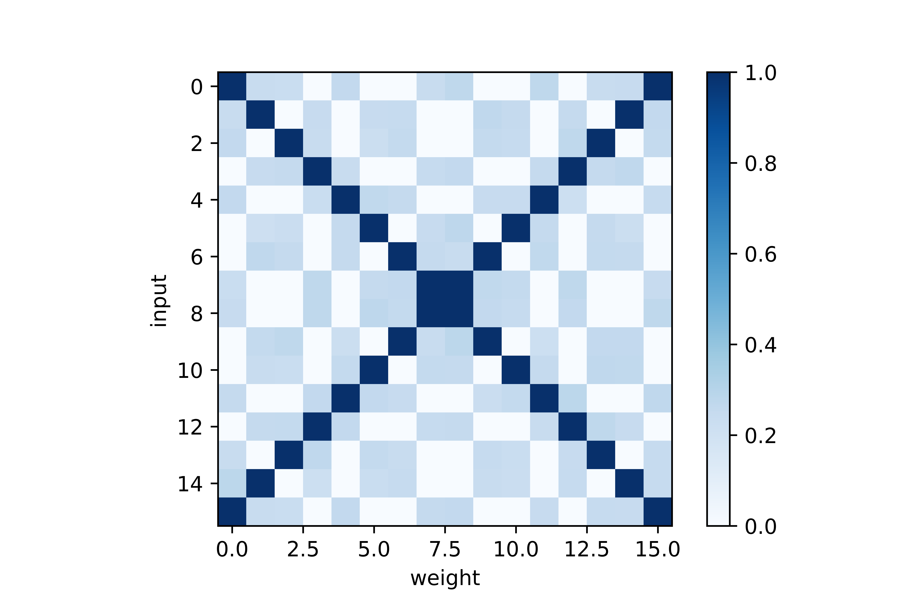
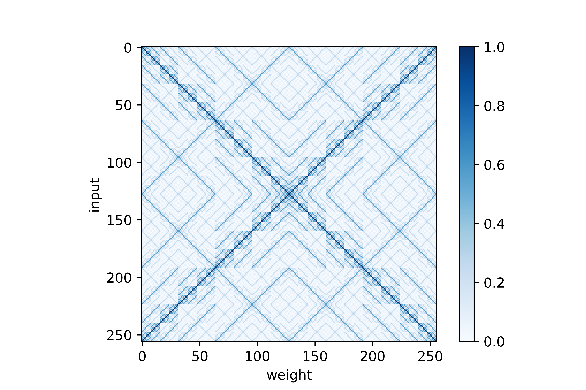

# Quantum Perceptron
Qiskit implementation of a simple quantum perceptron. In collaboration with Ferdinando D'Apice.

We followed the paper [An Artificial Neuron Implemented on an Actual Quantum Processor](https://arxiv.org/pdf/1811.02266.pdf)
by F. Tacchino et al., with some fixes.

These scripts allow one to simulate a quantum circuit with N=2 qubits.

Every component takes care of a specific bit flip.

One should successively apply the bit flips for U_i e and then for U_w like it's described in the article.

N.B. the article constructs the circuit differently; here we're just brute forcing.

If you follow the instructions in the article carefully, you wouldn't get to the code displayed here.
We suppose there's an error in the article, that's addressed here.

Inside equation (10), O_j is defined as the tensor product from 0 to m-1.
We think the product should go from 0 to N-1.

## Inputs vs weights for N=2

## Inputs vs weights for N=3

